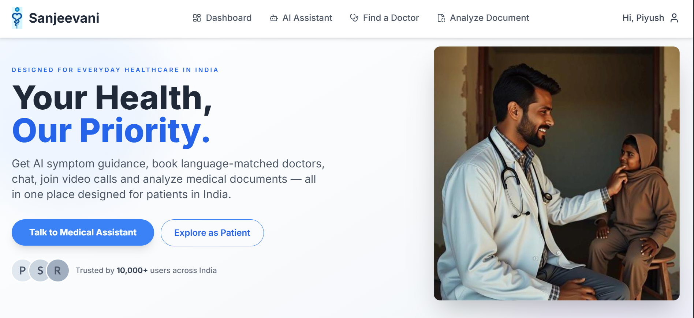
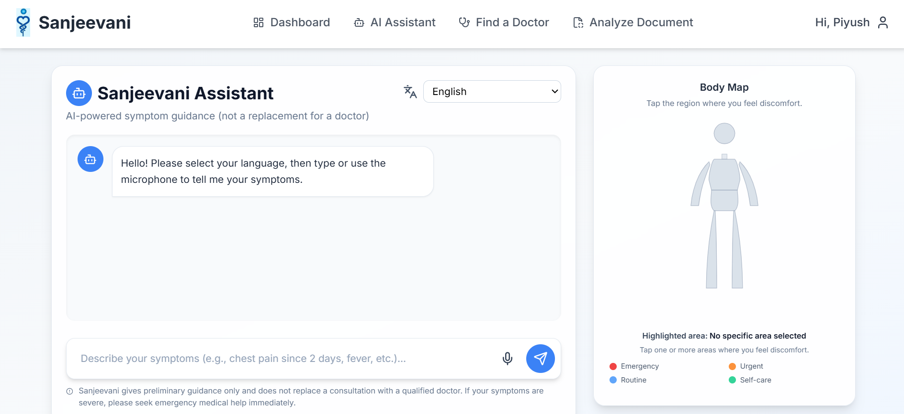
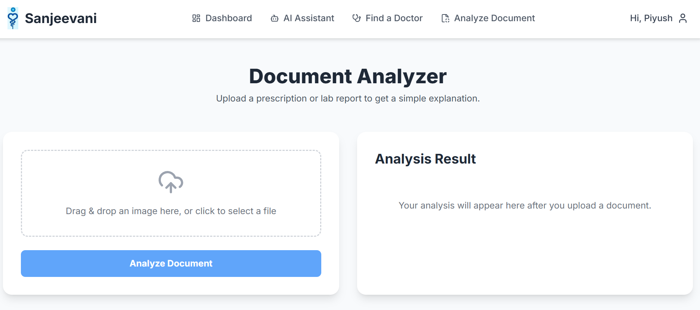
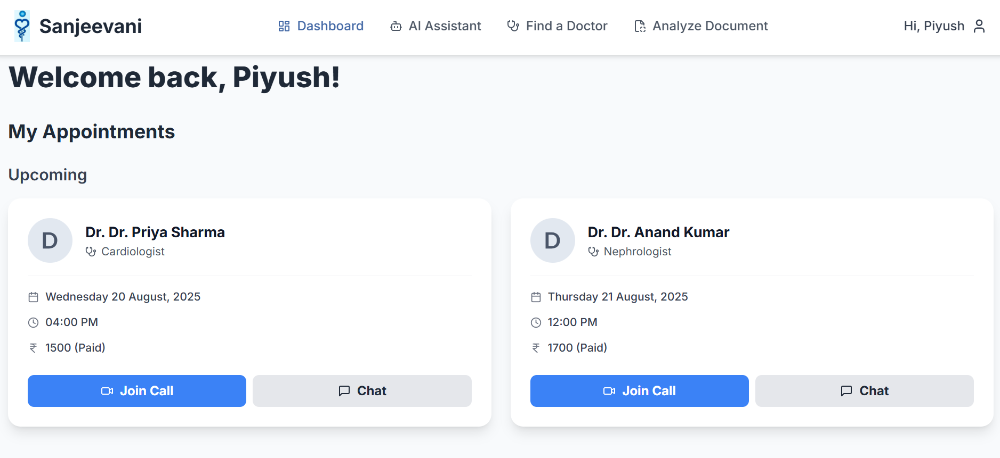
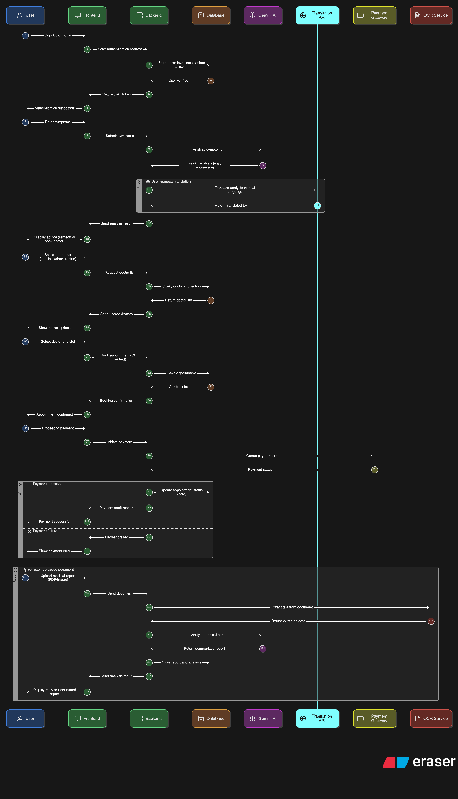

# 🏥 Sanjeevani - AI Powered Healthcare Platform  

## 🩺 Problem Statement  
In rural and semi-urban areas, people often face challenges in accessing timely healthcare.  
- Difficulty in finding the right doctor nearby  
- Lack of medical guidance for early symptoms  
- Limited access to local language support in digital health apps  
- Difficulty in understanding doctor prescriptions and lab reports 

These challenges can lead to late diagnosis, delayed treatment, and increased health risks.  

## 💡 Our Solution – Sanjeevani  
Sanjeevani bridges this healthcare gap by providing:  
- **AI-powered symptom checker** to guide patients instantly  
- **Doctor discovery & booking system** with available slots    
- **Local language translation** for inclusivity  
- **Real-time health tips** to encourage preventive care
- **Medical Document Analysis** to get simple explanation 

By combining AI with a user-friendly healthcare booking system, Sanjeevani ensures faster, accessible, and more reliable healthcare — especially for underserved regions.  

## 🚀 Features  

### 1. Conversational AI Medical Assistant  
- Intelligent chatbot for symptom checking.  
- Multi-language conversation with **contextual memory**.  
- Provides safe preliminary guidance for minor issues.  
- Recommends doctor consultation for serious conditions.  

**Tech Stack**:  
- AI: Google Gemini API (`gemini-2.5-flash`)  
- Backend: Node.js, Express.js  
- Frontend: React.js (`useState`, `useEffect`)  

---

### 2. Multi-Lingual Voice Support   
- Full **voice accessibility** in multiple Indian languages (Hindi, Bengali, Tamil, etc.).  
- Users can **speak symptoms** and **hear AI responses**.  
- Bridges the digital and language divide.  

**Tech Stack**:  
- Speech-to-Text: Web Speech API (`SpeechRecognition`)  
- Text-to-Speech: Web Speech API (`SpeechSynthesis`)  
- Backend: Node.js (generates responses in selected language)  
- Frontend: React.js  

---

### 3. AI-Powered Document Analyzer  
- Upload **medical prescriptions or lab reports** as images.  
- Performs **OCR** to extract text.  
- AI model explains documents in **simplified language**.  
- Analysis history stored in database.  

**Tech Stack**:  
- AI Vision & OCR: Google Gemini Vision API  
- File Handling: Multer (for file uploads)  
- Backend: Node.js, Express.js  
- Frontend: React.js, react-dropzone  
- Database: MongoDB  

---

### 4. End-to-End Doctor Booking & Payments  
- Find & book doctors by **specialty, location, language**.  
- Secure **online payments** for consultation fees.  
- Appointment details stored in database.  

**Tech Stack**:  
- Payments: Razorpay API (Test Mode)  
- Backend: Node.js, Express.js  
- Frontend: React.js, React Router, Axios  
- Database: MongoDB  

---

### 5. Real-time Patient-Doctor Communication  
- After booking, a **private chat channel** is created.  
- **One-on-one real-time chat** between patients and doctors.  
- Auto-generated **video call link** for consultations.  

**Tech Stack**:  
- Real-time Chat: Socket.io  
- Video Conferencing: Jitsi Meet (dynamic rooms)  
- Backend: Node.js, Express.js, http (for Socket.io)  
- Frontend: React.js, socket.io-client  

---

### 6. Role-Based Authentication & Dashboards  
- Secure login system with **role-based access**:  
  - **Patient** → symptom checker, bookings, prescriptions.  
  - **Doctor** → appointments, patient records, chat.  
  - **Admin** → full platform control.  
- JWT-based authentication & route protection.  

**Tech Stack**:  
- Authentication: JWT, bcrypt.js  
- Backend: Node.js, Express.js middleware  
- Frontend: React.js, React Router, Context API  
- Database: MongoDB  

---

### 7. Admin Panel & Doctor Verification  
- Hidden **Admin Dashboard** for platform management.  
- Admin can **verify doctors** (only verified doctors are listed publicly).  
- Admin can view/manage patients and doctors.  

**Tech Stack**:  
- Backend: Node.js, Express.js (admin middleware)  
- Frontend: React.js (AdminRoute component)  
- Database: MongoDB (`isVerified` field in Doctor schema)  

---

## 🛠️ Tech Stack Overview  

- **Frontend**: React.js, Tailwind CSS, React Router, Axios  
- **Backend**: Node.js, Express.js  
- **Database**: MongoDB with Mongoose ORM  
- **Authentication**: JWT, bcrypt.js  
- **AI Integration**: Google Gemini API (Text + Vision)  
- **File Uploads**: Multer  
- **Payments**: Razorpay API  
- **Real-time Communication**: Socket.io, Jitsi Meet  
- **Voice Support**: Web Speech API  

---

## 📸 Screenshots

### HomePage 


### AI Assistant Page


### Doctor Booking Page


### Document Analysis Page


### Patient Dashboard Page


### Sequence Diagram of Sanjeevani


---

## ⚡ Installation & Setup  
 
```bash
1️⃣ Clone the repo 
git clone https://github.com/yourusername/Sanjeevani.git
cd Sanjeevani

2️⃣ Install dependencies for both backend & frontend
cd backend && npm install
cd ../frontend && npm install

3️⃣ Configure environment variables in .env (backend)
MONGO_URI=your_mongodb_connection_string
JWT_SECRET=your_jwt_secret
RAZORPAY_KEY_ID=your_key
RAZORPAY_KEY_SECRET=your_secret
GEMINI_API_KEY=your_api_key

4️⃣ Run backend
cd backend
npm start

5️⃣ Run frontend
cd frontend
npm start
